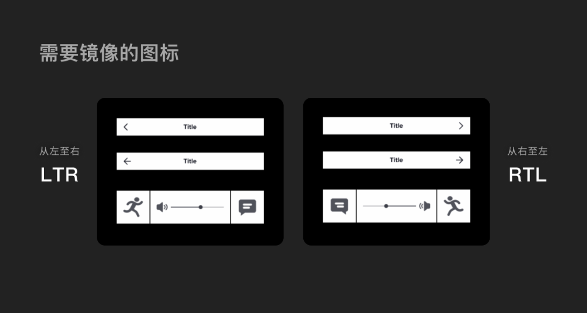
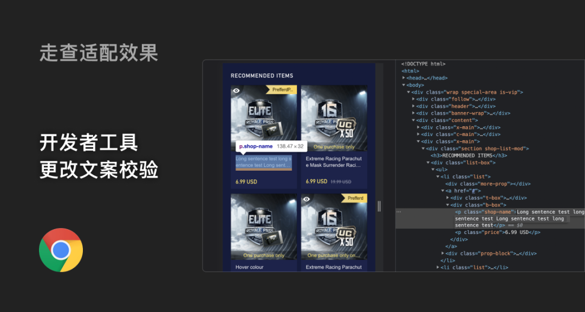

## 产品战略路径

**产品路线图是一个高级计划，显示基于战略实施路径的工作流程和里程碑**

产品路线图和Backlog不同，Blacklog是个低级别的计划。**Backlog**是产品团队的任务看板，它包含有关当前迭代，下一个迭代的任务以及Icebox（注1）的信息，Backlog的重点放在产品路径的技术实施方面。而产品路线图是一种战略规划工具，重点关注用户需求。它列出了产品开发中要完成的主要工作。在某些情况下，Backlog可能是路线图的一部分。

**什么是产品路线图？**

产品路线图（Product Roadmap）是一种战略计划工具，用于展示产品的发展方向、优先级设置以及关键里程碑。它通常用来向团队成员、管理层、利益相关者和客户明确传达一个产品从概念到市场的时间线和进展。产品路线图不仅帮助团队理解目标和期望，也是一种有效的沟通和协调资源的工具。

产品路线图的主要内容通常包括：

1. **时间线**：展示产品开发的时间框架，可以是具体的日期，也可以是阶段性的表示，如短期、中期和长期。
2. **版本规划**：标明各个阶段要发布的产品版本，以及每个版本的主要特性或改进点。
3. **关键特性和功能**：列出产品计划中要开发的主要功能和特性，通常会按照优先级排序。
4. **里程碑**：关键的时间点，比如产品设计完成、测试阶段开始、首次发布等。
5. **资源分配**：指示各个阶段所需的资源类型和数量，比如人力、资金和技术等。
6. **目标和指标**：定义产品成功的标准和要达到的业务指标，如用户增长、收入目标等。

好处：

1. **明确的方向和目标**：产品路线图为团队提供清晰的方向和长期目标，帮助每个人了解项目的总体目标和各自的责任，从而增强团队成员的目标感和归属感。
2. **优先级管理**：通过路线图，可以明确哪些功能和任务是优先级较高的。这有助于团队集中资源和精力在最关键的活动上，避免资源浪费。
3. **增强沟通**：产品路线图是一个有效的沟通工具，能够帮助团队成员、管理层、利益相关者和客户之间建立良好的信息流通。通过共享路线图，所有人都可以对产品的进展和期望保持一致的理解。
4. **协调资源分配**：路线图展示了不同阶段所需的资源，包括人力、资金和时间等。这有助于高效地分配资源，确保关键阶段或功能的开发不会因资源不足而受阻。
5. **促进决策制定**：当产品开发过程中遇到需要做出关键决策的时刻，路线图提供了必要的信息支持，帮助决策者考虑到产品的长期目标和当前的进展情况。
6. **适应市场变化**：虽然产品路线图是一种计划工具，但它也需要根据市场或技术变化进行灵活调整。这种适应性确保产品能够应对外部环境的变化，保持竞争力。
7. **提高透明度**：路线图提高了项目进展的透明度，使得所有参与者都能实时看到每个阶段的成果和未来的计划。这种透明度可以提升信任，减少误解和冲突。
8. **长期规划与短期行动的桥梁**：产品路线图不仅反映长期愿景，还细化到短期的具体行动，帮助团队在保持长远目标的同时，也能够关注当前的执行细节。

**（1）横轴**

横轴表示时间先后顺序，方向是从左向右。有些是有具体的时间，如下图：

有些没有具体的时间表，只按任务的状态（如“下一步”，“准备”，“完成”等）对任务进行排名。

**（2）纵轴**

纵轴通常表示产品路线图的优先级。

**从上到下：**最重要或最有价值的任务/想法始终位于最顶层。

**能驱动：**将重点放在构建和发布功能上，任务分类为“核心”，“实际”，“增强”等。这种方法最适合具有稳定市场的成熟产品。

**MoSCoW：**也是功能驱动的，区别是任务类别包括四类：拥有，应该拥有，可能拥有和不想要。

## 如何确定项目痛点

### 1. 用户调研

进行用户调研是获取直接信息的有效方式。可以通过以下几种方式进行：

- **访谈**：与用户进行一对一的深入访谈，询问他们在使用类似产品或服务时遇到的问题。
- **问卷调查**：设计问卷，包括开放性和闭合性问题，收集大量用户的观点和使用经验。
- **焦点小组**：组织一小群用户，讨论他们在特定领域或产品使用过程中的体验和挑战。

### 2. 观察和用户测试

根据目标用户群体选择测试参与者，然后观察用户在自然环境中如何使用产品或进行任务，可以揭示他们在使用过程中遇到的障碍和不便：

- **用户测试**：邀请用户测试现有的产品或原型，并观察他们的使用行为。
  - **一对一测试**：邀请用户到一个受控的环境（例如实验室），进行面对面的测试。让用户完成特定的任务，同时观察和记录他们的行为和反应。
  - **远程测试**：如果用户无法亲自到场，可以使用远程监控工具，如Zoom或UserTesting.com，来观察用户在自己的环境中如何使用产品。
  - **行为记录**：使用视频记录、屏幕捕捉软件和行为记录工具（如热图和点击追踪工具）来记录用户的操作和行为。
- **行为分析**：利用数据分析工具，比如网站的点击率分析、应用的用户行为记录等，来了解用户的实际操作模式和可能的掉率点。
  - **直接观察**：注意用户在使用过程中遇到的困难、他们的反应以及他们如何解决问题。
  - **访谈和反馈**：测试完成后，对参与者进行访谈，收集他们的直接反馈和建议。
  - **数据分析**：使用统计软件和分析工具处理收集到的定量数据，如完成任务的时间、错误率和任务成功率。
  - **结果汇报**：将观察和数据分析结果整合成报告，明确指出用户遇到的问题和潜在的改进点。
  - **行动计划**：基于测试结果，制定具体的改进措施，如修改设计、优化流程或改进功能。

- **测试类型**: 

  **1. 可用性测试（Usability Testing）**

  - **目的**：评估用户在使用产品时的效率、效果和满意度。
  - **方法**：让用户在监控环境下完成一系列预定义任务，同时观察他们的行为和挑战。
  - **应用场景**：适用于任何阶段的产品，特别是在设计初期和产品发布前。

  **2. A/B 测试**

  - **目的**：比较两个或多个版本的产品或功能，看哪个版本的表现更好。
  - **方法**：将用户随机分配到不同的测试组，每组使用不同版本的产品，然后比较关键性能指标。
  - **应用场景**：常用于优化网页设计、邮件营销活动和其他可直接量化的用户互动。

  **3. 眼动追踪测试（Eye Tracking）**

  - **目的**：了解用户在查看界面时的视觉路径和关注点。
  - **方法**：使用眼动追踪设备记录用户的眼球移动。
  - **应用场景**：适用于评估广告、网页布局和信息架构的视觉效果。

  **4. 焦点小组（Focus Groups）**

  - **目的**：收集用户对产品或概念的看法、意见和感受。
  - **方法**：选择一小组目标用户，进行有引导的讨论。
  - **应用场景**：适合初期市场研究和获取用户对新概念的直观反应。

  **5. 体验测试（Beta Testing / Field Testing）**

  - **目的**：在产品推向市场前，让实际用户在真实环境中测试，收集反馈。
  - **方法**：向用户提供产品的最终版本或接近最终版本，收集他们使用过程中的数据和意见。
  - **应用场景**：适用于产品开发的后期，确保产品在发布前能满足用户需求。

  **6. 任务分析（Task Analysis）**

  - **目的**：详细了解完成特定任务时用户的行为和思维过程。
  - **方法**：观察用户在执行任务时的步骤，记录他们的操作和决策。
  - **应用场景**：适用于深入理解用户如何与产品交互，特别是复杂的操作。

  **7. 日志分析（Log Analysis）**

  - **目的**：通过分析用户的行为日志来了解他们的行为模式。

  - **方法**：收集和分析用户在应用中的操作记录，如点击、滚动、登录等。

  - **应用场景**：适合数字产品，可以远程自动收集数据。

    

### 3. 市场分析

研究竞争对手的产品和市场反馈，了解他们如何解决或未能解决用户的需求：

- **竞争对手分析**：研究竞争对手的产品特点、用户评价和市场定位。

  **1. 确定竞争对手**

  假设你运营一个在线零售商店，主要销售电子产品。你的直接竞争对手可能包括其他电子产品的在线零售商，如Best Buy或Newegg。间接竞争对手可能是像亚马逊这样的综合性在线市场，尽管它们销售多种产品，但也提供电子产品。

  **2. 收集信息**

  **信息来源**：

  - **公司网站**：访问竞争对手的官方网站，查看其产品目录、价格、退货政策和用户支持。
  - **财务报告**：如果竞争对手是上市公司，其年度和季度报告会公开，这些文档可以提供关于其财务状况和战略重点的宝贵信息。
  - **消费者论坛和评价网站**：如Trustpilot或Reddit，了解消费者对竞争对手产品的看法和满意度。

  例如，如果你分析Best Buy，你可能会注意到它提供的竞争优势包括广泛的实体店网络，允许客户在线购买后在店内提货，这增加了便利性和即时满足感。

  **3. 分析竞争优势和劣势**

  - **优势**：Best Buy强大的品牌认知和广泛的分销网络是其明显的优势。他们的产品多样化和高效的物流也提供了竞争力。
  - **劣势**：高运营成本可能是其潜在劣势，因为维持实体店涉及显著的固定成本。

  **4. 使用分析工具**

  - **SWOT分析示例**：对于Best Buy，
    - **优势**：品牌信誉、广泛的实体网络、强大的供应链。
    - **劣势**：高运营成本、对实体店的依赖在数字化趋势中可能成为累赘。
    - **机会**：增长的在线销售市场、新兴市场的扩展。
    - **威胁**：电子商务竞争者如亚马逊、市场需求变化快速。
  - **五力模型**：
    - **行业内竞争**：高度竞争的电子产品市场。
    - **潜在新进入者的威胁**：中等，新进入者需要显著的资本投入。
    - **替代品的威胁**：高，尤其是从亚马逊等更大型的在线零售商。
    - **供应商的议价能力**：较低，大型零售商通常能够对供应商施加较大影响。
    - **买家的议价能力**：高，消费者可以轻易比较不同平台的价格和服务。

  **5. 监控竞争动态**

  - **技术工具**：设置Google Alerts监控Best Buy的新闻提及。使用Social Mention追踪其在社交媒体上的提及情况，了解品牌形象和用户反馈。

  **6. 应用竞争情报**

  基于分析结果，你可能决定实施以下策略来增强你的电子商务平台的竞争力：

  - **差异化**：提供额外的服务，如更灵活的退货政策或更优质的客户服务，以区别于Best Buy。
  - **价格策略**：实施更具竞争力的定价策略，特别是在高需求产品上，以吸引价格敏感的消费者。
  - **营销活动**：加强数字营销努力，特别是在社交媒体和搜索引擎优化（SEO）上，以提高在线可见度和吸引更多的流量。

  

- **行业报告**：阅读相关的行业报告，分析市场趋势和用户反馈，寻找常见的问题点。

  

### 4. 数据分析

通过分析用户数据，包括反馈、支持请求、退货率等，可以识别用户不满足的领域：

- **用户反馈**

  **数据收集**：

  - **直接反馈**：通过在线调查、产品评价、社交媒体和电子邮件收集用户反馈。
  - **间接反馈**：监控和分析客户服务对话（如聊天记录、电子邮件、电话通话记录）来识别常见问题和用户不满的领域。

  **分析工具和方法**：

  - **情感分析**：使用自然语言处理（NLP）工具来分析用户评论和社交媒体帖子的情感倾向，区分正面和负面评论。
  - **主题分析**：应用文本挖掘技术识别评论中常见的话题，例如配送问题、产品质量或客户服务。

  **例子**：

  1. 使用情感分析工具对用户评论进行分类，发现大量用户在提到配送服务时使用了“延迟”、“失望”等负面词汇。

  2. 通过主题分析，识别出一部分用户对某一产品线的电池寿命表达了不满。

     

- **性能数据**：分析产品的使用数据，识别功能故障或用户体验中的瓶颈。

  **数据收集**：

  - **使用数据**：通过嵌入式分析工具（如Google Analytics, Mixpanel）收集关于用户如何与网站或应用互动的数据。
  - **操作日志**：分析后端系统记录的日志，了解系统的错误率、响应时间等技术指标。

  **分析方法**：

  - **行为流分析**：跟踪用户在网站或应用上的路径，识别在哪一步骤用户流失最多。
  - **性能监测**：定期检查系统性能指标，如页面加载时间、服务器响应时间，与行业标准比较，发现潜在的瓶颈。

  **例子**：

  1. 行为流分析显示，用户在结账页面退出率异常高，可能是由于结账流程复杂或页面加载时间长。

  2. 性能监测发现，产品详情页的加载时间比竞争对手平均水平慢50%，这可能导致用户不满和流失。

     

### 5. 建立用户画像

创建详细的用户人物画像，包括用户的基本信息、行为特征、需求和痛点。这有助于更加深入地理解目标用户群体。

人物画像（Customer Persona）是一种营销和产品设计工具，它帮助团队通过创建虚构的理想用户来理解和共情其目标客户群。建立有效的人物画像通常涉及收集和分析数据，然后基于这些信息创建详细的角色描述。以下是建立人物画像的一般步骤：

**1. 确定研究目标**

明确你为什么要创建人物画像以及你希望通过这个过程解决什么问题。这可能是为了改善产品设计、优化用户体验、调整营销策略等。

**2. 收集数据**

收集关于目标用户的定量和定性数据。这可能包括：

- **市场研究**：利用问卷调查、焦点小组讨论和一对一访谈收集数据。
- **用户行为数据**：通过分析工具如Google Analytics收集用户如何与你的产品或服务互动的数据。
- **社交媒体分析**：分析目标用户在社交平台上的行为和偏好。
- **客户支持记录**：分析客户查询和反馈，了解他们的需求和痛点。

**3. 分析数据并找出模式**

分析收集的数据，找出不同用户群体间的共同点和差异。关注以下方面：

- **人口统计特征**：年龄、性别、教育背景、职业等。
- **地理位置**：居住地区、文化背景等。
- **行为特征**：购买行为、品牌忠诚度、产品使用频率等。
- **心理特征**：动机、偏好、生活方式、价值观等。

**4. 创建人物画像**

根据分析结果，创建三到五个代表性的人物画像。每个人物画像应该包括：

- **名称和照片**：赋予每个画像一个名字和虚构的照片，使其更加生动。
- **背景故事**：描述他们的个人背景、职业和家庭状况。
- **人口统计特征**：包括年龄、性别、收入水平等。
- **目标和需求**：他们使用产品或服务的目的和需求。
- **痛点**：他们在使用产品或服务时面临的问题和挑战。
- **购买动机**：驱动他们购买的因素。
- **媒体使用习惯**：他们获取信息的主要渠道，如特定的社交媒体平台、新闻网站等。

## 原型图

低保真原型（如纸上草图或线框图）-- 高保真的交互式原型（使用工具如Sketch, Figma, Adobe XD制作）

**1. 可视化设计概念**

原型图将产品设计从理论转化为可视化的形式，使团队能够看到并理解产品的外观和工作原理。这是从简单的草图到高保真交互式原型的过程，提供了产品概念的具体展示。

**2. 促进团队沟通**

原型图为项目团队提供了一个共同的讨论基础，帮助设计师、开发人员、产品经理和利益相关者之间进行有效沟通。通过原型，各方可以更容易理解产品功能、界面布局和用户流程，减少误解和错误。

**3. 测试和验证设计假设**

通过创建原型，团队可以在开发过程中早期测试产品概念和设计假设。这包括用户测试，通过观察目标用户与原型交互，收集反馈，评估设计是否符合用户需求和期望。

**4. 优化用户体验**

原型使设计师能够迭代和细化用户界面和用户体验。通过在开发前测试原型，设计师可以识别并解决潜在的用户体验问题，优化交互流程，确保最终产品提供顺畅和直观的用户体验。

**5. 节约开发成本和时间**

原型有助于在编写代码之前发现设计问题，避免了在开发阶段进行昂贵和耗时的更改。通过前期的原型测试和修改，可以大大减少后期的返工，提高开发效率。

**6. 吸引投资者和利益相关者**

一个清晰、互动的原型可以帮助吸引投资者和利益相关者的兴趣。原型展示了产品的潜在价值和可行性，有助于在早期阶段获得支持和资金。

**7. 提供实施指导**

对于开发团队而言，原型提供了实现最终产品的具体视觉和功能指导。它确保开发过程中的每个功能模块都符合设计意图和业务目标。

## 产品需求文档

### 一、版本信息
- 版本号
- 创建日期
- 审核人

### 二、变更日志
| 时间 | 版本号 | 变更人 | 主要变更内容 |

### 三、文档说明
#### 名词解释
| 术语 / 缩略词 | 说明 |

### 四、需求背景
#### 产品 / 数据现状
#### 用户调研
- 调研方法、样本情况及关键结论
- 🌟跨文档实时更新和同步的功能说明
#### 竞品分析
- 主要信息、关键结论
- 🌟跨文档实时更新和同步的功能说明

### 五、需求范围
- 需求范围或信息架构的罗列

### 六、功能详细说明
#### 产品流程图
- 如何创建产品流程图
#### 交互原型图
- 插入 Figma 设计稿或设计稿地址
#### 功能说明
| 序号 | 模块 | 功能 | 功能详细说明 | 交互图 |

### 七、非功能需求
- 列举产品营销、运营、财务、法务需求等

### 八、埋点
| 参数名 | 参数说明 | 参数值 |

### 九、项目规划
- 附加项目管理文档

### 附录
- 数据分析报告
- 用户调研报告
- 设计分析报告

## 设计原则

### 尼尔森十大设计原则

**系统状态的可见性**：系统应始终保持用户了解当前状态，通过适当的反馈和在合适的时间给予反馈。

- **例子**：一个文件上传到云服务的界面显示一个进度条，实时更新上传百分比，让用户明确知道上传进度。

**系统与现实世界的匹配**：系统应使用用户熟悉的语言，以自然的和逻辑的顺序呈现信息。

- **例子**：一个医疗应用使用常见的医疗符号和术语（如心电图图标表示心脏健康），让用户可以直观地理解功能。

**用户控制与自由**：设计应提供撤销和重做的选项，以便用户可以轻松纠正错误。

- **例子**：一个文本编辑器允许用户随时通过“撤销”按钮撤销最后的操作，或者使用“重做”按钮恢复操作。

**一致性与标准**：系统应保持一致性，避免让用户猜测相似情境下的操作方式是否相同。应遵守行业标准。

- **例子**：多个应用程序中的保存图标通常使用相同的磁盘图标，帮助用户迅速识别保存功能。

**错误预防**：良好的设计可以预防问题的发生，通过设计元素减少错误的机会。

- **例子**：在提交表单时，如果用户遗漏了一个必填字段，系统会自动高亮该字段并提醒用户填写，防止提交不完整的表单。

**识别而非回忆**：系统应减轻用户的记忆负担，通过使元素可见或容易检索来帮助用户识别功能和选项，而非要求他们回忆信息。

- **例子**：网上银行服务在用户进行重要操作前显示一个摘要页面，让用户可以识别并确认所有关键信息，而不需要回忆之前的每一步操作。

**灵活性与效率的使用**：设计应适应所有用户的操作，无论是新手还是经验丰富的用户，通过允许定制和提供快捷方式来提高效率。

- **例子**：高级用户可以在软件中使用键盘快捷键进行操作，这比使用鼠标点击更快速，从而提高了操作效率。

**美学与最小化设计**：界面应不包含不必要的信息，每个额外的单位信息都会在一定程度上增加与相关信息竞争的内容。

- **例子**：一个简洁的用户界面，如Google首页，主要关注搜索功能，几乎没有任何多余的元素，减少了用户的注意力分散。

**帮助用户识别、诊断和解决错误**：错误消息应清晰明了，表达具体的问题，并提供简单的解决方案。

- **例子**：当用户输入的密码格式错误时，系统提供具体的错误信息，例如“密码必须包含至少8个字符，包括一个大写字母和一个数字”。

**帮助与文档**：尽管应该努力使系统易于理解和使用，但有时需要提供帮助和文档。这些文档应易于搜索，专注于用户的任务，列出具体的步骤，并不过于庞大。

- **例子**：一个复杂的数据分析软件提供一个详细的帮助文档，用户可以通过关键词搜索来找到关于特定功能的步骤说明和使用示例。

https://www.uisdc.com/nielsen-design-principle-6

### 常见产品设计原则

1. **人性化设计**：这是国产化设计的核心原则之一，强调以人为本，关注用户的需求和体验。在产品设计中，需要充分考虑中国用户的文化背景、使用习惯和心理感受7。
2. **满足刚需、痛点、高频**：周鸿祎提出优秀的产品应该首先满足用户的刚需、痛点和高频需求，其次要有良好的用户体验3。
3. **减少用户出错**：产品设计应帮助用户避免错误，提供正确的引导，而不是仅仅通过错误对话框来保护程序3。
4. **易学性**：产品应该易于学习和使用，提供适时的帮助和指引，使用户能够快速掌握产品的功能3。
5. **为停止做准备**：产品设计应考虑到用户在使用过程中可能遇到的中断情况，并采取措施保存用户数据，减少重复操作3。
6. **做好反馈**：产品应通过过程反馈和结果反馈告知用户应用的状态和操作结果，提供人性化的交互体验3。
7. **内容为先**：产品设计应突出内容，优化屏幕资源利用率，把焦点放在用户更注重的内容上3。
8. **服务于每个人**：产品设计原则应考虑无障碍设计，尽可能地包容和清晰易懂，服务于所有用户，包括那些不习惯使用互联网的人1。
9. **产品设计的四大基本原则**：产品设计中还强调亲密性、对齐、重复和对比等原则，以提升用户体验2。

### 国际化与本地化
产品不依赖指定区域，满足全球用户可读性的前提下完成正常运行，不出现严重影响使用的错误；

一、 语言差异性
全球文化多元各异，最直观的体现便是在语言和文字上。如何用一套设计方案来兼容存在各种各样差异的多国语言呢？这正是多语言设计的难点所在。
首先，我们需要认识各类语言间存在哪些主要差异。

1、字符形态的差异
字符是语句的基本构成单位。不同的文化发展背景下诞生出了形态各异的字符样式。而部分语言会共用一套字符体系。常见的字符体系有如下几种类型。

从图形的角度分析这些字符的形态，不难发现，像拉丁字母以及西里尔字母，字符笔划构成相对简单，且笔划多为平直线条或是规整的弧线。而像阿拉伯字母、泰文等字符，组成相对复杂，笔划线条特殊的曲度较多。这是非常关键的字符形态差异，它将会影响后续我们对字体的选择。

2、内容长度的差异
在不同语言下，同样含义的内容进行翻译后，得到的文本长度可能会有较大的差异。如何通过设计兼容这些信息，正是做多语言产品最大的难点所在。

因此，在多语言设计阶段，非常建议基于英语进行设计(善用谷歌翻译)，以便于更直观地对信息兼容进行处理和判断。这里需要提醒的是，不建议大家用最习惯的中文进行占位，因为中文可以精炼文字，信息本身较短，很容易产生多语言适配的“盲区”。

3、词汇分界的差异
语言还分为带有词汇分界、不带有词汇分界两种情况。带有词汇分界的语言有英语、俄语等，分界意味着他们的语句以单词为最小单位。而中文、泰语等语言是没有分界的，一个语句中除了标点符号分隔，字符都是相连的。这也是影响段落布局的一个重要因素。

4、阅读顺序的差异
阅读顺序分为LTR (Left to Right)和RTL (Right to Left)两种。我们常见的绝大部分语言都是从左到右的阅读顺序，而使用特殊右至左顺序的，则以阿拉伯语为代表。不同的阅读顺序，决定了布局时信息对齐、元素排布、甚至图标图示，都可能存在不同的规则。

四、核心原则：可读性、包容性
可读性包含字符可读性、内容可读性；包容性包含布局包容性、认知包容性

1、可读性原则
1.1 字符可读性

字符可读性，主要针对的是在应用风格化字体时，需考虑到在不同语言下的显示效果。
部分产品因为品牌调性或美术风格的需要，会引用带有特殊风格个性的字体。而我们发现，市面上大部分风格化字体都是基于拉丁字母设计的。而那些形态特殊的字符，可能会比较难找到同种风格的风格化字体。即便有，它们的可读性受字体影响的风险会更高，因此检验字符可读性尤为必要。

1.2 内容可读性

内容可读性，指页面容纳信息时，是否给用户传递出了足够多的内容，让用户能达到最基本的信息理解，而不是靠猜。因此我们要针对多语言内容的长度特性，留有一定信息空间——尤其是信息使用了缩略处理时，需谨慎地确认露出的部分是否足以被用户理解。

2、包容性原则

2.1 布局包容性

布局包容性，即需要设计同学在元素、组件、模块等设计中，要进行弹性的设计考量，通过合理的布局设置，更好地兼容极多或极少内容的情况。
布局的包容性对于平台型产品尤为重要。如果是一次性产出的、纯展示型产品，细致地根据实际内容检查调整适配效果并不需要太大功夫。但如果是需要长期维护、内容持续变更的平台型产品，一个高度包容性的布局，才能帮助产品用有限的成本达成较好的落地效果。

字体的选择同样会影响布局包容性。当你选择了一个默认字符尺寸太超乎寻常的字体（过扁、过宽）时，在产品存在多语言多字体的情况下，会发现即便是同样的文本参数，单个字符宽度却相差很大。这会使得文本展示空间变得更不可控，导致适配风险增大。

2.2 认知包容性

认知包容性，是指设计时需要考虑到不同文化背景下用户，对于某些元素、符号的认知是否相通。例如，当产品出现需要单独使用图标来指代信息的情况时，需尽量保证选用的图标具有全球性的大众共识，并且不能产生歧义。当然，若非极端情况（如文字信息实在是兼容不下），大部分场景下还是建议尽量将图标配合文字使用，帮助不同语言、不同互联网认知水平的用户更好地理解并使用产品。

五、设计方案实施

1、基础样式
1.1 字阶

在同样的文字参数下，不同语言字符的体积视觉感受确实会略有不同。但遇到体量较为复杂庞大的产品，建议使用同一套字阶应对，尽可能降低设计成本和维护成本。可以基于本平台用户群体量级最大的语言为准来制定

2、通用布局
2.1 关注文本空间
预留文本空间
普遍情况下，多语言场景下文本长度会大于中文场景的文本长度，因此需要考虑预留更多文本空间，以保证信息露出的有效性。过小的露出空间（如只能露出一个单词）会让用户无法理解内容，产生困惑。

选择排列方式

在多语言设计中，排列方式的选择，需要视功能的实际场景确定。
两类信息在同一水平下横排，就必然会需要分割有限的宽度空间，这种情况下如果文本超长需要换行时，信息可能会显得略微杂乱；但它的好处在于节约纵向空间，在信息不长或者横行空间较大的情况下仍可以使用。
如果使用上下排列的方式，文本容纳的空间也将会更大，换行时的显示效果会相对更为可控。

当图标与文本内容组合出现时，同样也需要考虑合适的排列方式。竖排更强调图标，可以应用在强调状态的场景下，如结果页；而横排时图标与文本同级，图标做辅助的说明作用，更适用于轻提示、列表等场景。

但值得注意的是，在多个图标及文字并存的场景下，多语言设计布局会更常用横排的方式来兼容信息，例如快捷操作，或是一些入口场景。横排更能保证文字说明的露出效率，以及提升样式布局的规整度，并且也更方便内容条目的拓展。

2.2 关注段落空间
注意最小段落宽度
当页面的横行分割较多时，单个段落宽度就会变得较小。此时在某些语言场景下容易出现单个单词换行，甚至宽度都容纳不下一个极长的单词情况。因此，在多语言场景下，需要保证段落有一定的宽度容纳信息。移动端小屏幕建议谨慎使用一行三个的布局方式。

注意最小段落宽度

段落空间“加大”有限宽度

排版时也可以通过改变排列方式加大段落宽度，只是这样会导致同样高度下可展示的卡片数量变少，信息密度降低，因此需要根据实际情况取舍；如果实在改变不了段落宽度，还可以通过缩小字号或字间距，变相加大宽度，尽可能容纳多一些信息。

2.3 关注信息对齐

常用左对齐
如前文所说，不同语言在书面上的最小单位不同，为了更好的兼容各种情况，建议多用左对齐。因为像英语这种按单词分界的语言，很难保证每行内容宽度一致，并且中文常用的两端对齐的效果也并不能适用。多语言场景段落的左对齐相比居中对齐，更能带给用户较好的阅读体验。

同类信息水平对齐

当一个卡片模块中有多类信息并存时，需要关注重要信息的水平对齐，确保阅读动线的流畅，便于用户获取信息。

限定高度内使用下对齐 

下对齐的使用，能帮助设计师在不改变限定空间尺寸的情况下兼容延展更多信息。例如大图卡片空间内的文本。下对齐之所以优于上对齐，是因为能它避免信息不足时，可能会浮在空中的情况。

特殊的“右对齐”——阿语规则
阿拉伯语界面需要根据一定的规则来满足这个地区用户从右至左阅读的需求，但其中也存在一些并不需要用RTL做处理的信息。设计阶段如果想要快速产出RTL界面，也可以应用设计软件中一些现有的插件资源来实现。协作中也可以将阿语规则与开发同学优先对齐，由开发实现后，最后再进行细节的检查。

3、组件使用
3.1 标签组件

在中文场景下，标签通常精简为2-4字。而在英语这类带有分界的语言下，通常建议标签内最多不超过两个单词，或是使用数字和符号代替，如20%off 或 -20% 代替 20 percent off。如果一些辅助描述信息，必须展示3个及以上单词才能说清楚，建议以文本形式放到界面中，而不是使用标签组件，以保证信息的可拓展性。

例：亚马逊的标签一般情况下只会承载促销说明用的短词组。而对商品的更多信息补充，如配送范围、官方认证等，会直接用文本的形式补充在商品列表中。

3.2 按钮组件

竖排的按钮组合相比横排按钮，能兼容更多信息，因此在多语言产品下的使用会更为广泛。

非均等场景的按钮组合，需要限制图标下文字长度；如果为可能分界的语言，建议使用单个单词，否则建议更换成其他按钮组合样式。

3.3 通知栏组件

在移动端的多语言产品中，通知栏组件一行容纳不下全部文案的情况非常常见。在文本超出通知栏宽度的情况下，需要灵活使用信息横向滚动、或是带操作的方式，允许用户进入下一级或配合气泡、弹窗，确保用户有办法能获知完整内容。

3.4 选项卡组件

当选项卡选项大于等于三个时，建议使用等间距的选项设计，而不是均分宽度的选项设计，以避免文案溢出，同时显示信息更均匀紧凑。

4、图标设计要点

4.1 选用有大众共识的图形

图形需要满足认知包容性原则，可以多去观察成熟的全球性产品，何时会使用到纯图标的场景，又使用了什么样的图标。基础图形如代表播放的三角形、代表喜欢的爱心型，都是比较具有大众共识的。另外一些本身模拟了常见物品的图标，也不容易出错，如代表录制的摄像机、代表收藏的标签等。

4.2 避免出现特定指代元素

在图标设计中，可能会使用到一些特定的信息作为装饰，如文字或者是符号。如果这些符号带有特定区域，如美元的货币符号、或是赞的汉字，在全球性多地区的产品图标中必须谨慎使用。建议用更通用的元素代替，避免产生歧义。

4.3 RTL场景图标规则

RTL场景中，并非所有图标都需要镜像。例如暗示真实物体时，图标可以保持一致。需要镜像的常为带有方向含义的图标。

有个比较特殊的场景值得说明：在内容播放场景中，播放按钮以及进度指示反应的是播放的方向，因此保持从左至右即可；而音量值的大小控制，是需要镜像的。

4.4RTL常用语言
- 阿拉伯语
- 希伯来语
- 波斯语
- 乌尔都语
- 意第绪语
- 迪维西语
语言的普遍特征有：
1. 句子从右到左阅读
2. 事件发展顺序从右到左进行
3. 左箭头 ← 表示向前运动，右箭头 → 代表向后运动
使用这些语言的人口数量相当大，特别是在波斯湾地区由于石油经济发展特别迅速。对于面对中东地区出海的产品，是不能回避的问题。

针对 RTL 语言的通用设计原则有：
- 在代码中声明 RTL
- 将整体界面左右镜像
- 左右箭头代表的前后含义相反
- 涉及方向的图标需要镜像
- 文本资源基本右对齐
- 不进行镜像的有
  - 不传达方向的图标，如 Email
  - 通常用右手拿着的物品的图标，如 电话
  - LTR 数字、不需翻译的外文
  - 图像、时钟、拟物、禁止符

于某种特定的语言情况，会在对应的本地化部分提及。
5、落地还原
在完成设计输出后，如何与开发同学配合落地，尽量在真实文案上线前打好适配基础，也是设计师需要投入精力关注的。
1、设定规则

1.1 设定适配规则

在设计方案交付到开发时，需要预先明确一些规则与开发同学对齐。
例如在非通栏的容器中，需要向开发同学示意信息的极限宽度和内边距，并且明确超出该范围的情况下，应直接省略、滚动显示、还是换行处理。
如省略处理，需要检查省略号前展示的内容是否可被用户理解；如滚动显示处理，需要评估是否会过于吸引视线，打扰到用户；如换行处理，需要进一步明确极限行数，保证容器高度可控。

在交付设计稿前，设计师应有意识地在设计稿中尽可能展示极限情况，再配合沟通，更能提升双方协作效率。

1.2 设定字体应用规则

为了呈现效果等合理性，字体选择也必须进行更详尽的适配考量。以下内容主要介绍在网页产品中，可以如何制定字体选择和应用的规则。
我们在项目设计的过程中进行过一次对游戏类网站中字体应用的研究，总结出一些规律：
即多数网页产品通常会定义风格化字体和基础字体两种。风格化字体以凸显品牌调性/美术个性为目标，常应用于标题；而基础字体则应用于所有正文或控件当中。

基础字体的选择一般从网页默认可引用的字体库中选择即可。常用的系统字体有Arial或者Helvetica等。如果在字体声明中没有特别列举某些语言的字体，浏览器在识别时会自动转为提供对应语言的常用系统默认字体，如Thonburi（泰语）、Geeza Pro（阿语），因此不需要针对所有语言逐一做字体声明。

2、验收效果
2.1 走查适配效果

在走查还原效果时，建议多运用代码走查，在html结构中增加文本或是增加模块，检验开发同学是否有进行响应适配情况的处理，处理效果是否符合预期。

2.2 检查字体显示情况

着重检查font-family的规则，是否符合不同语言下的效果预期。其中需要注意，如果需要特别声明中文字体，务必把英文基础字体最前置，以防中文字体包中的字母样式覆盖英语场景。

另外也需要检查你选择的网页系统字体，在不同语言下实际应用中的效果是否符合预期。
在阿拉伯语的网页下，tohoma覆盖后文字会看起来特别粗，暂不能特别明确是否是字体问题，但因为存在风险，我们将不会选择tahoma为第一基础字体，也不会列进字体声明里。

六、其他

1.不要采用旗帜图标指示语言。

存在有几个问题：
- 难以让旗帜和语言一对一映射；
- 用户可能被迫需要选择一个他国前缀的选项；
- 可能引起地缘政治的争议；
- 旗帜可能随着时间的发展而被替换，有更换成本。
虽然旗帜图标在选择效率上会略有提高，但仍然不建议使用。
但也有例外：
- 当本质上是选择区域时，例如 Apple 官网。
  

2.文字与组件必须分隔排版，不使用基于语言元素的拼接组件。
通过拆解语句构成的用户表单，在不同语言的文法系统下可能无法应用。

左侧：组件与文字混排 右侧：组件与文字分离

3.界面文字尽量采用系统默认匹配的字体。

要避免用户缺失产品预设的字体。界面文字尽量采用系统默认匹配的字体。

iOS 与 Android 常用字体

如果有必要，可以将特殊字体的文字转换为图像进行展示。

4.少用、慎用粗体、斜体、下划线等样式。

不是所有的字体都内含了粗体和斜体，虽然部分软件或系统提供了算法加粗或倾斜，但效果较差。设计师并不能确保本地化后的文字是否有足够品质的粗体和斜体，另外部分语言的强制粗体或斜体会导致可读性下降，如不应当使用中文的斜体。

而下划线除了推荐应用于网页超链接中，本身就不太建议用于移动产品，更大的问题是不适合某些类型的文字，如内含基线的天城文。

5.避免使用宗教、神话相关的内容、标志、符号等。
完全掌握理解各国家地区的文化既不现实也不经济，在这里列出一些通用的设计限制框架。

主要问题有：
- 宗教、节日、文化、手势的含义差异较大
- 涉及到仅母语者/当地人才能理解的内容
- 容易忽略各地图标、图像、颜色、文化隐喻的不同
- 某些含义可能无法在另一种文化中简单的表达出来
- 涉及民族、地缘、宗教、政治的信息容易产生冲突
- 注意色情、暴力、瘾品内容
- 用户滥用平台功能发布禁忌内容
- 当地法律法规或道德文化对隐私要求很高

有很多社会习俗、语言习惯是外乡人不易理解的，能够理解并熟练表达这些内容是能融入当地文化的表现。如果是一个本地化的版本，强力推荐你的产品这样做；但在基础的国际化版本下，则不建议使用。

例如 John Doe 或 Lorem Ipsum，或是更常见的 The quick brown fox jumps over the lazy dog. 都是作为拉丁语系设计师常用的内容，类似的，他们可能并不能理解「小明」「小强」「河蟹」「江湖」「桃花源」等用语。

在图形、图像、色彩方面，设计师常用的隐喻也许并不能奏效，经常会有意外。使用异国文化、图形图像时注意收集本地化团队建议。

除了美国，世界上大部分邮箱不像这样

尽量采用各大平台原生的标准图标，或基于标准图标进行重设计。
配色小技巧，对于完全陌生文化的国家地区，可以参考其旗帜的配色。

6.货币应使用 ISO 4217 货币代码，配合本地语言使用。
RMB 并不是国际通用的人民币缩写，而是由 ISO 4217 定义的 CNY。同样的，为了避免出现其他标准上或理解上的错误，建议统一使用 ISO 标准。

应使用 ISO 4217 货币代码，配合本地语言使用。

不建议直接使用符号代表货币，如「￥」有可能是人民币，也有可能是日元。
一般建议只使用本币，辅助货币直接换算，如人民币 5 角应计为 0.5 元，80 撒丹应计为 0.8 泰铢。

7、禁忌
第一个需要注意的是将所有的「国家 Country」改为「国家/地区 Country/Region」，同时不要使用旗帜作为图标

## 关键技能

### 1. **沟通技能  -- 社团管理/项目管理/爱好经历**

- **倾听能力**：有效地倾听用户的意见和反馈，理解他们的需求和挑战。
- **提问技巧**：能够设计和提出开放性和具体性问题，以深入挖掘用户的真实想法和需求。

### 2. **分析技能 -- 数据分析/数据挖掘**

- **数据分析**：使用统计工具和软件（如 Excel, Google Analytics, Tableau 等）来分析用户数据和市场趋势。
- **问题解决**：基于收集到的数据和信息，能够识别问题根源并提出有效解决方案。

### 3. **研究技能 -- 问卷调查经验**

- **用户研究**：进行用户访谈、问卷调查和焦点小组讨论，以收集定性数据。
- **竞争对手分析**：研究和分析竞争对手的产品或服务，了解他们是如何应对相似的用户痛点。

### 4. **人际交往与协作能力  -- 社团管理/项目管理/爱好经历**

- **团队合作**：与产品开发团队、市场团队和客户服务团队等协作，共同分析用户反馈和市场数据。
- **影响力和说服技巧**：能够向利益相关者（如高层管理和投资者）清晰地传达发现的用户痛点和提出的解决策略。

### 5. **技术技能 -- 原型图绘制经验/开发经验/测试经验/需求文档撰写**

- **使用相关工具**：熟练操作用户研究和项目管理工具，如 Jira, Asana, UserTesting, SurveyMonkey 等。
- **基本的编程或设计能力**：理解用户界面设计的基本原则，能够与设计师和开发者有效沟通。

### 6. **创造性思维 -- 创业项目/创新比赛**

- **创新能力**：在既有的用户反馈和市场数据基础上，能够创造性地思考新的产品功能或服务模式。
- **敏捷思维**：适应快速变化的市场和技术环境，灵活调整研究方向和方法。

### 7. **项目管理 -- 时间协作**

- **时间管理**：有效地安排时间，确保研究活动和项目进度符合预定时间表。
- **资源管理**：合理分配有限的资源，如预算、人员和工具，以最大化研究效果。

### 2B 2C 产品区别

To B（To Business）和To C（To Customer）是两种不同的产品定位和商业模式，它们主要的区别在于目标客户群体的不同。以下是To B和To C产品的主要区别：

1. **目标客户**：
   - To B产品的目标客户是企业或组织，它们提供的是面向企业的服务或产品，通常涉及较为复杂的业务流程和决策过程13。
   - To C产品的目标客户是个人消费者，它们提供的是面向终端用户的服务或产品，通常更侧重于用户体验和便捷性34。
2. **产品复杂性**：
   - To B产品往往较为复杂，需要考虑个性化和定制开发相关内容，因为企业客户通常有特定的需求和业务流程1。
   - To C产品则相对简单，追求标准化和易用性，以便快速吸引和满足广大消费者的需求4。
3. **决策过程**：
   - To B产品的购买决策通常涉及多个决策者和更复杂的决策过程，可能包括采购、财务、技术等多个部门的参与3。
   - To C产品的购买决策通常由个人消费者直接作出，过程相对简单快捷。
4. **销售周期**：
   - To B产品的销售周期通常较长，因为需要经过详细的商务谈判、方案定制和合同签订等步骤3。
   - To C产品的销售周期则相对较短，消费者可以快速在线购买或下载使用。
5. **盈利模式**：
   - To B产品的盈利模式可能包括销售产品、提供定制服务、收取订阅费用或基于交易量的佣金等1。
   - To C产品的盈利模式则可能依赖于直接销售、广告收入、订阅服务或应用内购买等4。
6. **市场营销策略**：
   - To B产品的市场营销策略更侧重于关系建立、行业解决方案展示和专业销售技巧3。
   - To C产品的市场营销策略则更侧重于品牌建设、用户体验和通过社交媒体等渠道吸引消费者注意力。
7. **客户关系管理**：
   - To B产品需要维护长期的客户关系，重视客户成功和客户服务，因为企业客户的留存对于业务的持续性至关重要3。
   - To C产品则更注重于新用户的获取和提高用户满意度，以促进口碑传播和复购。
8. **产品迭代和更新**：
   - To B产品可能需要根据企业客户的反馈进行定制化的迭代和更新，以满足特定需求1。
   - To C产品的迭代和更新则更侧重于满足广泛用户的需求，以及快速响应市场变化和用户反馈。

## 产品质量的标准

#### 评估标准

1. **满足用户需求**：产品是否解决了用户的痛点或满足了用户的需求是评估产品好坏的首要条件。
2. **用户体验（UX）**：产品是否提供流畅、直观且愉悦的用户体验，包括界面设计、交互逻辑和使用便捷性。
3. **产品质量**：产品是否稳定可靠，没有频繁的故障或错误，以及是否能够持续提供高质量的服务。
4. **创新性**：产品是否具有创新的特点，能够提供独特的价值主张，区别于市场上的其他产品。
5. **市场适应性**：产品是否能够适应市场的变化，满足当前和未来市场的需求。
6. **客户满意度**：用户对产品的满意程度，可以通过用户反馈、评价和推荐指数来衡量。
7. **盈利能力**：产品是否具有良好的盈利模式和盈利能力，能够为企业带来经济上的回报。
8. **可持续性**：产品是否具有长期发展的潜力，包括技术可持续性、环境可持续性和社会可持续性。
9. **合规性**：产品是否符合相关法律法规和行业标准，避免法律风险。
10. **安全性**：产品是否能够保护用户数据的安全，防止数据泄露和滥用。
11. **扩展性和灵活性**：产品是否容易扩展和升级，以适应未来的需求变化。
12. **品牌影响力**：产品是否能够提升品牌价值，增强品牌在市场中的影响力。
13. **社会影响**：产品是否对社会有积极的影响，包括提升生活质量、促进教育、环境保护等。
14. **成本效益**：产品的成本效益分析，即产品的价值与其成本之间的比率。
15. **技术支持和服务**：产品是否提供有效的技术支持和服务，帮助用户解决使用过程中的问题。

#### 评估指标

1. **用户获取成本（CAC）**：获取一个新用户所需的平均成本。
2. **客户终身价值（LTV）**：一个用户在与产品的关系维持期间所带来的总收益。
3. **转化率**：用户完成期望动作（如购买、注册）的比例。
4. **留存率**：用户在一段时间后继续使用产品的比例。
5. **日活跃用户（DAU）/月活跃用户（MAU）**：每天/每月至少使用产品一次的用户数量。
6. **用户满意度（CSAT）**：用户对产品满意程度的调查得分。
7. **净推荐值（NPS）**：用户推荐产品给他人的可能性的指标。
8. **平均会话时长**：用户每次使用产品的平均时间。
9. **跳出率**：用户访问产品后不久就离开的比例。
10. **页面/屏幕加载时间**：产品页面或屏幕完全加载所需的时间。
11. **崩溃率**：产品在用户使用过程中崩溃的比例。
12. **功能使用率**：产品中各个功能的使用频率。
13. **市场占有率**：产品在目标市场中所占的份额。
14. **收入增长率**：产品收入随时间的增长速度。
15. **成本效益分析**：产品带来的收益与投入成本的比较。
16. **ROI（投资回报率）**：产品带来的总收益与总成本的比率。
17. **客户流失率**：在一定时间内失去的客户比例。
18. **产品更新周期**：产品更新和迭代的频率。
19. **用户反馈和评论**：用户在社交媒体、应用商店等平台上的反馈和评论。
20. **合规性和安全性指标**：产品符合行业标准和法规的程度，以及安全漏洞的数量。
21. **团队效率和协作**：产品开发团队的工作效率和协作水平。
22. **品牌认知度**：用户对产品品牌的认知程度。
23. **社会影响评估**：产品对社会的正面或负面影响。
24. **环境影响评估**：产品对环境的可持续性影响。
25. **技术债务**：产品开发过程中积累的技术债务，可能影响未来的维护和升级。

# 职业发展路线

1. **产品专员**（Product Specialist）
   - **职责**：通常负责特定产品功能的研究和数据分析，支持产品经理进行市场调研和用户反馈的收集。
   - **发展重点**：学习产品管理的基础知识，如市场分析、用户调研方法和数据分析技能。
2. **产品助理**（Product Assistant）
   - **职责**：辅助产品经理处理日常管理任务，如会议记录、报告编写和进度更新。
   - **发展重点**：加深对产品开发流程的理解，提高项目管理和沟通能力。
3. **初级产品经理**（Junior Product Manager）
   - **职责**：管理较小的产品或项目，可能负责产品的一个主要功能或小型项目。
   - **发展重点**：实际操作和管理整个产品生命周期的初步经验，增强解决问题和决策制定的能力。
4. **中级产品经理**（Mid-Level Product Manager）
   - **职责**：负责更复杂或更大的产品，开始涉及产品战略的制定和执行。
   - **发展重点**：加强对市场趋势的洞察力，提升战略规划和用户体验设计的能力。
5. **高级产品经理**（Senior Product Manager）
   - **职责**：管理重要的产品线或多个项目，可能需要领导跨功能团队。
   - **发展重点**：在组织内部建立影响力，提升领导能力和复杂项目管理的技能。
6. **资深产品经理**（Lead Product Manager）
   - **职责**：在组织中担任关键的领导角色，可能负责多个产品线或定义公司的产品战略。
   - **发展重点**：专注于长期的业务影响和创新，提升高层管理和谈判技巧。
7. **产品专家**（Product Expert）
   - **职责**：作为行业或特定产品领域的权威专家，提供深度技术或市场洞察，支持产品创新和优化。
   - **发展重点**：深化特定领域的专业知识，成为思想领袖，影响行业标准和实践。

# 拼多多

## 应用推广策略

1. 社交裂变机制

- **拼团模式**：拼多多利用社交网络的传播力量，通过拼团购买的模式，鼓励用户邀请亲朋好友一起购买，以获取更低的价格。这种模式不仅增加了用户粘性，同时也实现了低成本的用户获取。

- **利用现有社交网络**： 社交裂变通过利用用户的现有社交网络，比如微信、QQ等，可以迅速传播到用户的亲朋好友中，实现快速的用户增长。

- **降低用户获取成本**： 与传统的广告推广相比，社交裂变可以以较低的成本获取新用户，因为用户的推荐通常比广告更能获得信任。

- **实现快速传播**： 社交裂变的传播速度通常非常快，尤其是当推广活动设计得吸引人时，可以在很短的时间内达到广泛的受众。

- **促进用户参与**： 社交裂变机制鼓励用户参与和互动，比如通过分享、邀请等方式参与活动，这可以增加用户的参与度和活跃度。

- **易于量化效果**： 社交裂变的效果通常很容易量化，比如通过跟踪邀请链接、分享次数等指标，可以清晰地看到裂变活动的效果。

- **适应性强**： 社交裂变机制可以适应不同的产品和市场，无论是实体商品还是数字服务，都可以通过社交裂变来推广。

- **创新的营销方式**： 社交裂变提供了一种创新的营销方式，可以与其他营销策略相结合，形成综合的营销组合。

  

2. 价格优势

- **百亿补贴**：拼多多推出了“百亿补贴”计划，对用户购买的商品进行直接补贴，确保平台上的商品价格具有竞争力，吸引价格敏感型消费者。

3. 市场定位

- **下沉市场**：拼多多明确定位于下沉市场，专注于服务三线及以下城市和农村地区的用户，这些用户群体对于性价比有更高的要求。

4. 品牌合作

- **品牌化战略**：拼多多通过引入知名品牌，提升平台的品质形象，吸引更多追求品质的消费者。同时，通过与品牌合作，提供正品保证，增强消费者信任。

5. 农业上行

- **农产品直销**：拼多多推动农产品上行，帮助农民销售产品，同时为消费者提供新鲜且价格合理的农产品，这一策略有助于提升平台的社会价值和用户粘性。

6. 技术创新

- **个性化推荐**：拼多多利用大数据和机器学习技术，为用户推荐个性化商品，提高用户满意度和购买转化率。

7. 内容社区建设

- **拼小圈**：拼多多建立了内容社区“拼小圈”，用户可以分享购物体验和生活动态，增强了用户之间的互动和社区归属感。

8. 游戏化体验

- **互动游戏**：拼多多引入了如“多多果园”等互动游戏，通过游戏化的体验吸引用户，提高应用的使用频率和用户粘性。

9. 广告和市场推广

- **多渠道广告**：拼多多通过电视、网络、社交媒体等多渠道进行广告宣传，提高品牌知名度和吸引新用户。

10. 物流和售后服务

- **物流系统**：拼多多通过优化物流系统，提高配送效率，改善用户的购物体验。

11. 新业务拓展

- **多多买菜**：拼多多推出社区团购服务“多多买菜”，进一步拓展业务范围，满足用户多样化的购物需求。

12. 用户数据分析

- **精细化运营**：拼多多通过深入分析用户数据，了解用户行为和偏好，实现精细化运营，提高营销效率。

13. 营销活动

- **节日促销**：拼多多在重大节日和购物季期间推出各种促销活动，如“618”、“双11”等，以刺激消费和提高销售额。